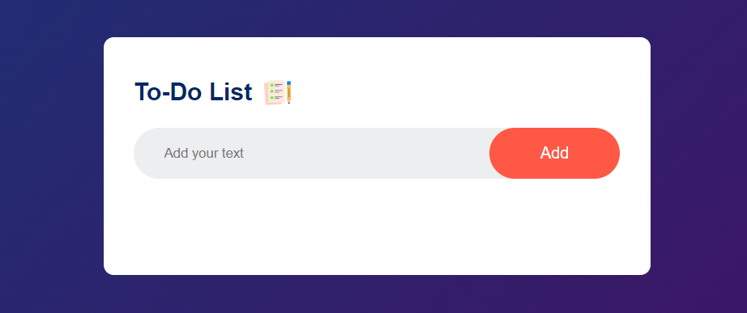

# To-Do-List-App

## Description 

📝MyToDoList: A responsive to-do list website 🌐📱 built using HTML, CSS, and JS. Save your tasks and data will present until cleared.

## Authors

- [Mannath Shaik](https://www.github.com/mannath93478) 

## Demo

Live Demo:

    
## Getting Started

To explore or modify the code, follow these steps:

1.Clone the repository

2.Open the project in your preferred code editor.

3.Make changes to the HTML, CSS, or JavaScript files as desired.

4.Test the changes locally.

5.Deploy the updated website to your preferred hosting platform.

## Features

1️⃣ Create and manage tasks easily.

2️⃣ Mark tasks as completed for progress tracking.

3️⃣ Responsive design for seamless usage across devices.

4️⃣ Save tasks and data persistently until cleared.

## 🔗 Links

For any questions or inquiries, please feel free to reach out. 

Mannath Shaik :

Thank you for visiting the page!
